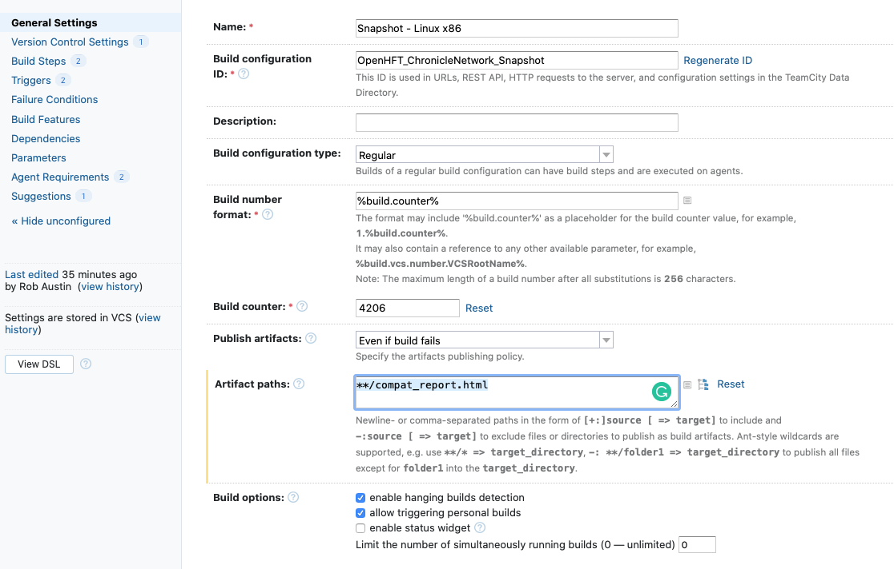
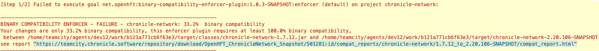

= Overview

This is a maven plugin that wraps - https://github.com/lvc/japi-compliance-checker

This plugin uses the perl scripts and components of japi-compliance-checker directly. So japi-compliance-checker has to be installed and available on your $PATH.

NOTE: If this plugin is run on a machine where japi-compliance-checker is not installed. A warning message will be seen, highlighting that the japi-compliance-checker is not available.


=== What it does

It allows us to better detect breaking changes of binary compatibility, this plugin enforces, that we only allow these changes, when there has been a change to the "MinorVersion”. 

The above is assuming the following maven version format : ( see also https://docs.oracle.com/middleware/1212/core/MAVEN/maven_version.htm#MAVEN8855) 

<MajorVersion>.<MinorVersion>.<IncrementalVersion>

NOTE: No validation is carried out if the current version is `<x>.<y>.0` or `<x>.<y>.0-SNAPSHOT`

= Install

* JDK or OpenJDK - development files
* Maven
* Perl 5
* https://github.com/lvc/japi-compliance-checker#install

$git clone git@github.com:lvc/japi-compliance-checker.git
$cd japi-compliance-checker/

== Linxu

```
sudo make install prefix=/usr
```

== Mac

=== Permissions

set the approximate permission
[source,shell script]
----
$chmod -R 775 <path>
----
=== Link

```
ln -s japi-compliance-checker.pl japi-compliance-checker 
```

=== Path 

Add the japi-compliance-checker to your path

for example on a mac if you have installed it to ~/<path>/japi-compliance-checker

[source,shell script]
----
$vi ~/.profile
----

add the following:

[source,shell script]
----
export PATH="$PATH:~/<path>/japi-compliance-checker"
----

= Configuration

|===
| parameter  | default value | Example | Required / Optional

| referenceVersion
| <x>.<y>.0
| 5.20.120
| optional

| artifactsURI
|
|
| optional

| expression
| japi-compliance-checker -lib %s %s %s
|
| optional

| binaryCompatibilityPercentageRequired
| 100
|
| optional

|===

=== Reference Version

If you specify a reference version this will be used instead of the default reference version. If the reference version you provide is not availible in maven central, an error will be reported. 
Hence if no reference version is provided then the default version is used. The default version is <x>.<y>.0 version, for example assume that you where on 5.20.143-SNAPSHOT then this would be checked ( by default ) against 5.20.0, If 5.20.0 does not exist in maven central, then an error will be reported.

=== Expression

`japi-compliance-checker -lib %s %s %s`
the `%s` are defind in the following order:

* name - the artifact name
* first jar  - reference version
* second jar - current project version

These jar will be resolved at runtime of the plugin.

This `expression`, is the expression that is passed directly to japi-compliance-checker, for more information on the options see https://github.com/lvc/japi-compliance-checker, or run:

[source,shell script]
----
japi-compliance-checker -help
----

=== ArtifactsURI

Used to host the error report on a teamcity server, see section below on Teamcity.

=== Binary Compatibility Percentage Required

When the `japi-compliance-checker` is run, it provides the `binary compatibility` as a percentage, if the percentage that is reported is lower than the `binaryCompatibilityPercentageRequired`, the validation will fail and a link will be provided to an html a report. By default the `binaryCompatibilityPercentageRequired` is set to 100%.

== Maven

[source,xml]
----
<plugin>
    <groupId>software.chronicle</groupId>
    <artifactId>binary-compatibility-enforcer-plugin</artifactId>
    <version>1.0.0</version>
    <executions>
        <execution>
            <phase>verify</phase>
            <goals>
                <goal>enforcer</goal>
            </goals>
            <configuration>
                <!-- the version that it checks against -->
                <!-- if not set it will check against the <x>.<y>.0 version -->
                <referenceVersion>2.20.2</referenceVersion>
                <expression>japi-compliance-checker -lib NAME %s %s</expression>
            </configuration>
        </execution>
    </executions>
</plugin>
----


== Teamcity

If you are using teamcity, then to host the report on your teamcity server you should set `**/compat_report.html` in the following ( see example ):



and set add the following to your config 

```
<configuration>
    <artifactsURI> <!-- YOUR TEAMCITY SERVER URL --> </artifactsURI>
</configuration>
```          

for example:

```
<plugin>
    <groupId>net.openhft</groupId>
    <artifactId>binary-compatibility-enforcer-plugin</artifactId>
    <version>1.0.3</version>
    <executions>
        <execution>
            <phase>verify</phase>
            <goals>
                <goal>enforcer</goal>
            </goals>
            <configuration>
                <referenceVersion>1.7.12</referenceVersion>
                <artifactsURI>https://teamcity.chronicle.software/repository/download</artifactsURI>
            </configuration>
        </execution>
    </executions>
</plugin>
```
for example like this



If you set the `artifactsURI` configuration and you are not running on teamcity this setting will be ignored.
            


            


